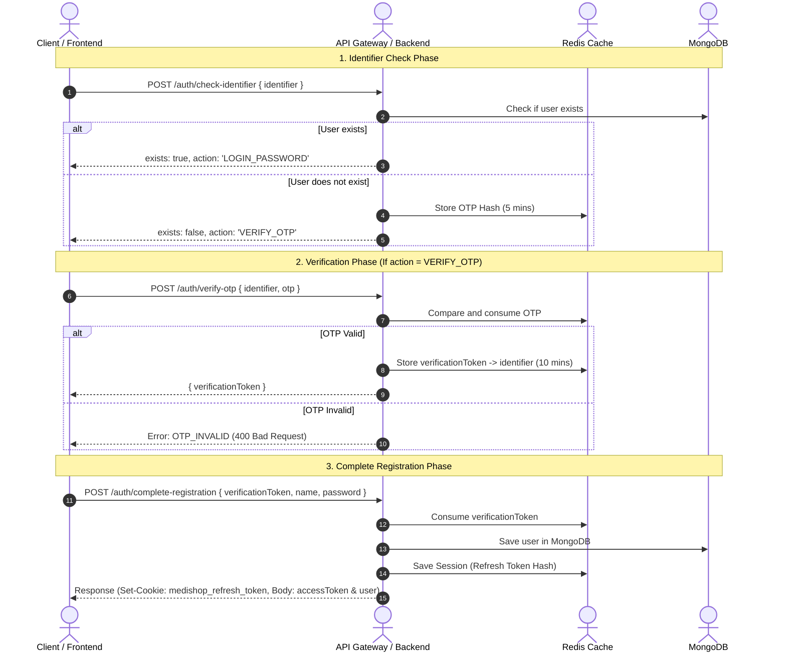

# MediShop Authentication API Integration Guide

This guide is designed for frontend developers to easily integrate the MediShop Authentication flow. It documents all the authentication endpoints, request/response formats, validation schemas, and common error responses.

---

## General Configurations
- **Base URL:** `/api/v1/auth`
- **Content-Type:** `application/json`
- **Protected Routes:** Requires the HTTP Authorization header: `Authorization: Bearer <accessToken>`
- **Session Cookie:** The long-lived refresh token is automatically stored and managed in a secure, HTTP-only cookie named `medishop_refresh_token`.

---

## Authentication Flow Diagram



---

## API Endpoints Reference

### 1. Check Identifier
Determine whether a user with the given identifier (Email or Bangladesh phone number) already exists, and determine the next action (Login or Registration via OTP).

- **Route:** `POST /api/v1/auth/check-identifier`
- **Authentication:** None (Public)
- **Request Body:**
  ```json
  {
    "identifier": "test@example.com"
  }
  ```
- **Validation Rules (Zod):**
  - `identifier`: Must be a valid email address OR a Bangladeshi phone number format (e.g., `+88017XXXXXXXX` or `017XXXXXXXX`).

- **Success Response (User Exists - Login Required):**
  - **Status Code:** `200 OK`
  ```json
  {
    "success": true,
    "message": "Identifier checked successfully",
    "data": {
      "exists": true,
      "action": "LOGIN_PASSWORD",
      "targetType": "email",
      "identifier": "test@example.com"
    }
  }
  ```

- **Success Response (User Does Not Exist - Registration OTP Sent):**
  - **Status Code:** `200 OK`
  - *Note: In development environment, the OTP is printed in the backend console (always `123456` if demo mode is enabled).*
  ```json
  {
    "success": true,
    "message": "Identifier checked successfully",
    "data": {
      "exists": false,
      "action": "VERIFY_OTP",
      "targetType": "email",
      "identifier": "test@example.com"
    }
  }
  ```

- **Common Error Response:**
  - **Status Code:** `400 Bad Request`
  ```json
  {
    "success": false,
    "message": "Validation failed",
    "errorCode": "VALIDATION_ERROR",
    "errors": [
      {
        "field": "identifier",
        "message": "Identifier must be a valid email address or Bangladesh phone number"
      }
    ]
  }
  ```

---

### 2. Verify Registration OTP
Verify the OTP code sent to the user's email or phone number.

- **Route:** `POST /api/v1/auth/verify-otp`
- **Authentication:** None (Public)
- **Request Body:**
  ```json
  {
    "identifier": "test@example.com",
    "otp": "123456"
  }
  ```
- **Validation Rules (Zod):**
  - `identifier`: Valid email or phone number.
  - `otp`: Must be exactly a 6-digit numeric string.

- **Success Response:**
  - **Status Code:** `200 OK`
  - *Note: Use this `verificationToken` to proceed to the registration completion API.*
  ```json
  {
    "success": true,
    "message": "OTP verified successfully",
    "data": {
      "verificationToken": "3fa85f64-5717-4562-b3fc-2c963f66afa6"
    }
  }
  ```

- **Common Error Responses:**
  - **Status Code:** `400 Bad Request` (Invalid OTP)
    ```json
    {
      "success": false,
      "message": "Invalid OTP.",
      "errorCode": "OTP_INVALID",
      "errors": null
    }
    ```
  - **Status Code:** `400 Bad Request` (OTP Session Expired)
    ```json
    {
      "success": false,
      "message": "OTP session expired. Please request a new code.",
      "errorCode": "OTP_EXPIRED",
      "errors": null
    }
    ```

---

### 3. Complete Registration
Create a new user profile and establish a session after verifying OTP.

- **Route:** `POST /api/v1/auth/complete-registration`
- **Authentication:** None (Public)
- **Request Body:**
  ```json
  {
    "verificationToken": "3fa85f64-5717-4562-b3fc-2c963f66afa6",
    "name": "John Doe",
    "password": "Password123"
  }
  ```
- **Validation Rules (Zod):**
  - `verificationToken`: Must be a valid UUID.
  - `name`: Must be at least 2 characters.
  - `password`: Must be at least 8 characters long, contain at least 1 letter, and contain at least 1 number.

- **Success Response:**
  - **Status Code:** `201 Created`
  - **Headers Set:** `Set-Cookie: medishop_refresh_token=<token>; HttpOnly; Secure; SameSite=Strict; Path=/api/v1/auth; Max-Age=604800`
  ```json
  {
    "success": true,
    "message": "Registration completed successfully",
    "data": {
      "user": {
        "id": "64cb1a29f8f2b3e414c718fa",
        "name": "John Doe",
        "email": "test@example.com",
        "phone": null,
        "role": "customer",
        "avatar": null,
        "isVerified": true,
        "createdAt": "2026-08-05T10:47:00.000Z"
      },
      "accessToken": "eyJhbGciOiJIUzI1NiIsInR5cCI6IkpXVCJ9..."
    }
  }
  ```

- **Common Error Responses:**
  - **Status Code:** `400 Bad Request` (Token Expired/Invalid)
    ```json
    {
      "success": false,
      "message": "Verification session expired. Please request a new OTP.",
      "errorCode": "VERIFICATION_TOKEN_EXPIRED",
      "errors": null
    }
    ```
  - **Status Code:** `409 Conflict` (User Already Exists)
    ```json
    {
      "success": false,
      "message": "User already exists.",
      "errorCode": "USER_ALREADY_EXISTS",
      "errors": null
    }
    ```

---

### 4. Login
Login an existing user with an identifier and password.

- **Route:** `POST /api/v1/auth/login`
- **Authentication:** None (Public)
- **Request Body:**
  ```json
  {
    "identifier": "test@example.com",
    "password": "Password123"
  }
  ```

- **Success Response:**
  - **Status Code:** `200 OK`
  - **Headers Set:** `Set-Cookie: medishop_refresh_token=<token>; HttpOnly; Secure; SameSite=Strict; Path=/api/v1/auth; Max-Age=604800`
  ```json
  {
    "success": true,
    "message": "Login successful",
    "data": {
      "user": {
        "id": "64cb1a29f8f2b3e414c718fa",
        "name": "John Doe",
        "email": "test@example.com",
        "phone": null,
        "role": "customer",
        "avatar": null,
        "isVerified": true,
        "createdAt": "2026-08-05T10:47:00.000Z"
      },
      "accessToken": "eyJhbGciOiJIUzI1NiIsInR5cCI6IkpXVCJ9..."
    }
  }
  ```

- **Common Error Responses:**
  - **Status Code:** `401 Unauthorized` (Invalid Credentials / Not Verified)
    ```json
    {
      "success": false,
      "message": "Invalid credentials.",
      "errorCode": "INVALID_CREDENTIALS",
      "errors": null
    }
    ```

---

### 5. Refresh Token
Acquire a new Access Token and rotate the Refresh Token.

- **Route:** `POST /api/v1/auth/refresh`
- **Authentication:** None (Implicit via Cookies). The client must include the `medishop_refresh_token` cookie.
- **Request Body:** None

- **Success Response:**
  - **Status Code:** `200 OK`
  - **Headers Set:** New `medishop_refresh_token` set in cookies (Rotated).
  ```json
  {
    "success": true,
    "message": "Token refreshed successfully",
    "data": {
      "user": {
        "id": "64cb1a29f8f2b3e414c718fa",
        "name": "John Doe",
        "email": "test@example.com",
        "role": "customer",
        "avatar": null,
        "isVerified": true
      },
      "accessToken": "eyJhbGciOiJIUzI1NiIsInR5cCI6IkpXVCJ9..."
    }
  }
  ```

- **Common Error Responses:**
  - **Status Code:** `401 Unauthorized` (Missing Cookie)
    ```json
    {
      "success": false,
      "message": "Refresh token is required.",
      "errorCode": "UNAUTHORIZED",
      "errors": null
    }
    ```
  - **Status Code:** `401 Unauthorized` (Token Reuse/Invalid Token)
    *Note: If token reuse is detected, all sessions are immediately revoked.*
    ```json
    {
      "success": false,
      "message": "Refresh token reuse detected.",
      "errorCode": "REFRESH_TOKEN_REUSED",
      "errors": null
    }
    ```

---

### 6. Logout
Invalidate the current refresh session and clear cookies.

- **Route:** `POST /api/v1/auth/logout`
- **Authentication:** None (Implicit via Cookies). The client must include the `medishop_refresh_token` cookie.
- **Request Body:** None

- **Success Response:**
  - **Status Code:** `200 OK`
  - **Headers Set:** Clears the `medishop_refresh_token` cookie.
  ```json
  {
    "success": true,
    "message": "Logged out successfully",
    "data": {
      "loggedOut": true
    }
  }
  ```

---

### 7. Forgot Password
Request an OTP to reset the password.

- **Route:** `POST /api/v1/auth/forgot-password`
- **Authentication:** None (Public)
- **Request Body:**
  ```json
  {
    "identifier": "test@example.com"
  }
  ```

- **Success Response:**
  - **Status Code:** `200 OK`
  - *Note: For security reasons, the response is generic even if the user does not exist in the database.*
  ```json
  {
    "success": true,
    "message": "If the account exists, a reset OTP has been sent",
    "data": {
      "sent": true,
      "targetType": "email"
    }
  }
  ```

---

### 8. Verify Reset OTP
Verify the OTP received for resetting the password.

- **Route:** `POST /api/v1/auth/verify-reset-otp`
- **Authentication:** None (Public)
- **Request Body:**
  ```json
  {
    "identifier": "test@example.com",
    "otp": "123456"
  }
  ```

- **Success Response:**
  - **Status Code:** `200 OK`
  ```json
  {
    "success": true,
    "message": "Reset OTP verified successfully",
    "data": {
      "verificationToken": "3fa85f64-5717-4562-b3fc-2c963f66afa6"
    }
  }
  ```

---

### 9. Reset Password
Set a new password using the verification token.

- **Route:** `POST /api/v1/auth/reset-password`
- **Authentication:** None (Public)
- **Request Body:**
  ```json
  {
    "verificationToken": "3fa85f64-5717-4562-b3fc-2c963f66afa6",
    "password": "NewPassword123"
  }
  ```

- **Success Response:**
  - **Status Code:** `200 OK`
  ```json
  {
    "success": true,
    "message": "Password reset successfully",
    "data": {
      "reset": true
    }
  }
  ```

---

### 10. Change Password
Change the password for a logged-in user.

- **Route:** `POST /api/v1/auth/change-password`
- **Authentication:** Required (Bearer Token)
- **Headers:** `Authorization: Bearer <accessToken>`
- **Request Body:**
  ```json
  {
    "currentPassword": "Password123",
    "newPassword": "NewPassword123"
  }
  ```

- **Success Response:**
  - **Status Code:** `200 OK`
  - **Headers Set:** Sets a new rotated `medishop_refresh_token` in cookies.
  ```json
  {
    "success": true,
    "message": "Password changed successfully",
    "data": {
      "user": {
        "id": "64cb1a29f8f2b3e414c718fa",
        "name": "John Doe",
        "email": "test@example.com",
        "role": "customer",
        "avatar": null,
        "isVerified": true
      },
      "accessToken": "eyJhbGciOiJIUzI1NiIsInR5cCI6IkpXVCJ9..."
    }
  }
  ```

- **Common Error Response:**
  - **Status Code:** `401 Unauthorized` (Invalid current password)
    ```json
    {
      "success": false,
      "message": "Invalid current password.",
      "errorCode": "INVALID_CREDENTIALS",
      "errors": null
    }
    ```

---

### 11. Get Current User Profile (Me)
Retrieve details of the currently logged-in user.

- **Route:** `GET /api/v1/auth/me`
- **Authentication:** Required (Bearer Token)
- **Headers:** `Authorization: Bearer <accessToken>`
- **Request Body:** None

- **Success Response:**
  - **Status Code:** `200 OK`
  ```json
  {
    "success": true,
    "message": "Authenticated user fetched successfully",
    "data": {
      "id": "64cb1a29f8f2b3e414c718fa",
      "name": "John Doe",
      "email": "test@example.com",
      "role": "customer",
      "avatar": null,
      "isVerified": true
    }
  }
  ```
