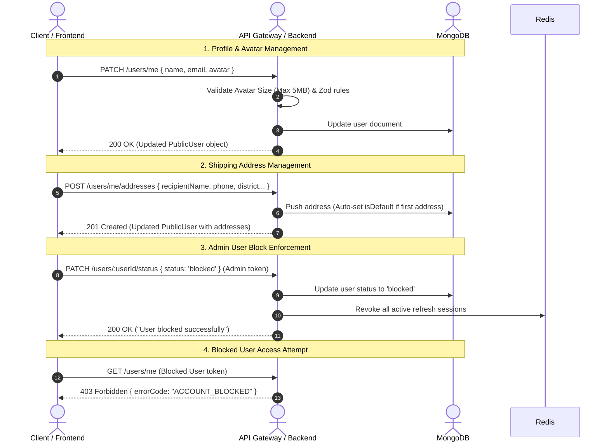

# MediShop User Profile & User Management API Integration Guide

This guide is designed for frontend developers to integrate MediShop User Profile management and Admin User Administration features. It documents all user-related endpoints, request/response formats, validation schemas, and error responses.

---

## General Configurations
- **Base URL:** `/api/v1/users`
- **Content-Type:** `application/json`
- **Protected Routes:** Requires the HTTP Authorization header: `Authorization: Bearer <accessToken>`
- **Admin Endpoints:** Requires an account with role `admin`.

---

## Architecture & Data Flow Diagram



---

## User Data Models Reference

### PublicUser Object Schema
```typescript
interface PublicUser {
  id: string;
  name: string;
  email?: string;
  phone?: string;
  role: 'customer' | 'pharmacist' | 'sales_staff' | 'inventory_manager' | 'admin';
  avatar?: string | null;
  status: 'active' | 'blocked';
  isVerified: boolean;
  addresses: UserAddress[];
  lastLoginAt?: string | null;
  createdAt: string;
  updatedAt: string;
}
```

### UserAddress Object Schema
```typescript
interface UserAddress {
  id: string;
  label?: string;
  recipientName: string;
  phone: string;
  division?: string;
  district: string;
  thana: string;
  addressLine: string;
  postalCode?: string;
  isDefault: boolean;
}
```

---

## API Endpoints Reference

### 1. Get Authenticated User Profile
Retrieve full profile details for the currently logged-in user.

- **Route:** `GET /api/v1/users/me`
- **Authentication:** Required (`Bearer <accessToken>`)
- **Request Body:** None

- **Success Response:**
  - **Status Code:** `200 OK`
  ```json
  {
    "success": true,
    "message": "Profile fetched successfully",
    "data": {
      "id": "64cb1a29f8f2b3e414c718fa",
      "name": "Nurul Islam",
      "email": "user@medishop.com.bd",
      "phone": "01711000000",
      "role": "customer",
      "avatar": "https://example.com/avatar.jpg",
      "status": "active",
      "isVerified": true,
      "addresses": [
        {
          "id": "64cb1a3bf8f2b3e414c718fc",
          "label": "Home",
          "recipientName": "Nurul Islam",
          "phone": "01711000000",
          "division": "Dhaka",
          "district": "Dhaka",
          "thana": "Dhanmondi",
          "addressLine": "House 42, Road 10/A, Dhanmondi R/A",
          "postalCode": "1209",
          "isDefault": true
        }
      ],
      "lastLoginAt": "2026-08-05T18:30:00.000Z",
      "createdAt": "2026-08-01T10:00:00.000Z",
      "updatedAt": "2026-08-05T18:30:00.000Z"
    }
  }
  ```

- **Common Error Response:**
  - **Status Code:** `401 Unauthorized`
    ```json
    {
      "success": false,
      "message": "Unauthorized.",
      "errorCode": "UNAUTHORIZED",
      "errors": null
    }
    ```
  - **Status Code:** `403 Forbidden` (If account is blocked)
    ```json
    {
      "success": false,
      "message": "Your account has been blocked by an administrator. Please contact support.",
      "errorCode": "ACCOUNT_BLOCKED",
      "errors": null
    }
    ```

---

### 2. Update User Profile
Update editable user profile fields including Name, Email, Phone, and Avatar/Profile Picture.

- **Route:** `PATCH /api/v1/users/me`
- **Authentication:** Required (`Bearer <accessToken>`)
- **Request Body:**
  ```json
  {
    "name": "Nurul Islam Shanto",
    "email": "shanto@medishop.com.bd",
    "avatar": "data:image/png;base64,iVBORw0KGgoAAAANSUhEUgAA..."
  }
  ```
- **Validation Rules (Zod):**
  - `name`: String, minimum 2 characters (Optional).
  - `email`: Valid email format (Optional).
  - `phone`: Bangladesh phone regex `^(\+88)?01[3-9]\d{8}$` (Optional).
  - `avatar`: String (URL or Base64 data string), max size 5MB (`max(5 * 1024 * 1024)`) (Optional).
  - *At least one field must be present in the request body.*

- **Success Response:**
  - **Status Code:** `200 OK`
  ```json
  {
    "success": true,
    "message": "Profile updated successfully",
    "data": {
      "id": "64cb1a29f8f2b3e414c718fa",
      "name": "Nurul Islam Shanto",
      "email": "shanto@medishop.com.bd",
      "phone": "01711000000",
      "role": "customer",
      "avatar": "data:image/png;base64,iVBORw0KGgoAAAANSUhEUgAA...",
      "status": "active",
      "isVerified": true,
      "addresses": [],
      "createdAt": "2026-08-01T10:00:00.000Z",
      "updatedAt": "2026-08-06T12:00:00.000Z"
    }
  }
  ```

- **Common Error Response:**
  - **Status Code:** `400 Bad Request` (Avatar size exceeds limit)
    ```json
    {
      "success": false,
      "message": "Validation failed",
      "errorCode": "VALIDATION_ERROR",
      "errors": [
        {
          "field": "avatar",
          "message": "Avatar image string must not exceed 5MB"
        }
      ]
    }
    ```

---

### 3. Get Shipping Addresses
Fetch all saved shipping addresses for the logged-in user.

- **Route:** `GET /api/v1/users/me/addresses`
- **Authentication:** Required (`Bearer <accessToken>`)

- **Success Response:**
  - **Status Code:** `200 OK`
  ```json
  {
    "success": true,
    "message": "Addresses fetched successfully",
    "data": [
      {
        "id": "64cb1a3bf8f2b3e414c718fc",
        "label": "Home",
        "recipientName": "Nurul Islam",
        "phone": "01711000000",
        "division": "Dhaka",
        "district": "Dhaka",
        "thana": "Dhanmondi",
        "addressLine": "House 42, Road 10/A",
        "postalCode": "1209",
        "isDefault": true
      }
    ]
  }
  ```

---

### 4. Add Shipping Address
Add a new delivery address for the user.

- **Route:** `POST /api/v1/users/me/addresses`
- **Authentication:** Required (`Bearer <accessToken>`)
- **Request Body:**
  ```json
  {
    "label": "Office",
    "recipientName": "Nurul Islam (Office)",
    "phone": "01898765432",
    "division": "Dhaka",
    "district": "Dhaka",
    "thana": "Gulshan",
    "addressLine": "Level 5, Crystal Tower, Gulshan Avenue",
    "postalCode": "1212",
    "isDefault": false
  }
  ```
- **Validation Rules (Zod):**
  - `recipientName`: Required, min 2 characters.
  - `phone`: Required, valid BD phone number (`01XXXXXXXXX`).
  - `district`: Required, min 2 characters.
  - `thana`: Required, min 2 characters.
  - `addressLine`: Required, min 5 characters.
  - `label`, `division`, `postalCode`: Optional.
  - `isDefault`: Optional boolean (automatically set to `true` if this is the user's first address).

- **Success Response:**
  - **Status Code:** `201 Created`
  ```json
  {
    "success": true,
    "message": "Address added successfully",
    "data": {
      "id": "64cb1a29f8f2b3e414c718fa",
      "name": "Nurul Islam",
      "addresses": [
        {
          "id": "64cb1a3bf8f2b3e414c718fc",
          "label": "Home",
          "isDefault": true
        },
        {
          "id": "64cb1a5cf8f2b3e414c718fd",
          "label": "Office",
          "recipientName": "Nurul Islam (Office)",
          "phone": "01898765432",
          "division": "Dhaka",
          "district": "Dhaka",
          "thana": "Gulshan",
          "addressLine": "Level 5, Crystal Tower, Gulshan Avenue",
          "postalCode": "1212",
          "isDefault": false
        }
      ]
    }
  }
  ```

---

### 5. Update Shipping Address
Edit an existing delivery address.

- **Route:** `PATCH /api/v1/users/me/addresses/:addressId`
- **Authentication:** Required (`Bearer <accessToken>`)
- **Path Parameters:** `addressId` (Valid Mongo ObjectId)
- **Request Body:** Partial address payload.

- **Success Response:**
  - **Status Code:** `200 OK`

---

### 6. Set Default Shipping Address
Mark a specific address as the primary default for checkouts.

- **Route:** `PATCH /api/v1/users/me/addresses/:addressId/default`
- **Authentication:** Required (`Bearer <accessToken>`)
- **Path Parameters:** `addressId` (Valid Mongo ObjectId)
- **Request Body:** None

- **Success Response:**
  - **Status Code:** `200 OK`
  ```json
  {
    "success": true,
    "message": "Default address set successfully",
    "data": { ... }
  }
  ```

---

### 7. Remove Shipping Address
Delete a saved address.

- **Route:** `DELETE /api/v1/users/me/addresses/:addressId`
- **Authentication:** Required (`Bearer <accessToken>`)
- **Path Parameters:** `addressId` (Valid Mongo ObjectId)

- **Success Response:**
  - **Status Code:** `200 OK`

---

### 8. Admin - List All Registered Users
Retrieve a paginated list of all users in the system with optional search and filters.

- **Route:** `GET /api/v1/users`
- **Authentication:** Required (`Bearer <accessToken>`, Role: `admin`)
- **Query Parameters:**
  - `page`: Integer (default: 1)
  - `limit`: Integer (default: 20, max: 100)
  - `search`: String (regex search on name, email, or phone)
  - `status`: String (`active` or `blocked`)
  - `role`: String (`customer`, `pharmacist`, `sales_staff`, etc.)

- **Success Response:**
  - **Status Code:** `200 OK`
  ```json
  {
    "success": true,
    "message": "Users fetched successfully",
    "data": [
      {
        "id": "64cb1a29f8f2b3e414c718fa",
        "name": "Nurul Islam",
        "email": "user@medishop.com.bd",
        "phone": "01711000000",
        "role": "customer",
        "avatar": null,
        "status": "active",
        "isVerified": true,
        "createdAt": "2026-08-01T10:00:00.000Z"
      }
    ],
    "meta": {
      "page": 1,
      "limit": 20,
      "total": 1,
      "pages": 1
    }
  }
  ```

---

### 9. Admin - Block or Unblock User
Block or reactivate a user account. If blocked, all active sessions for that user are immediately revoked.

- **Route:** `PATCH /api/v1/users/:userId/status`
- **Authentication:** Required (`Bearer <accessToken>`, Role: `admin`)
- **Path Parameters:** `userId` (Valid Mongo ObjectId)
- **Request Body:**
  ```json
  {
    "status": "blocked"
  }
  ```
- **Validation Rules (Zod):**
  - `status`: Must be `'active'` or `'blocked'`.

- **Success Response:**
  - **Status Code:** `200 OK`
  ```json
  {
    "success": true,
    "message": "User blocked successfully",
    "data": {
      "id": "64cb1a29f8f2b3e414c718fa",
      "name": "Nurul Islam",
      "email": "user@medishop.com.bd",
      "role": "customer",
      "status": "blocked",
      "isVerified": true
    }
  }
  ```

- **Common Error Responses:**
  - **Status Code:** `403 Forbidden` (Non-admin token)
    ```json
    {
      "success": false,
      "message": "Forbidden. Insufficient permissions.",
      "errorCode": "FORBIDDEN",
      "errors": null
    }
    ```
